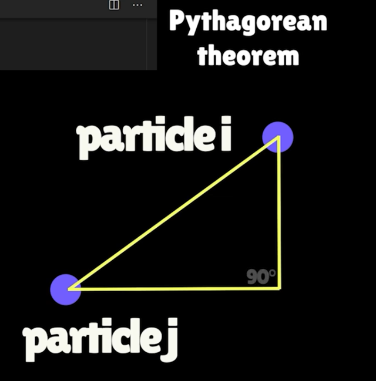
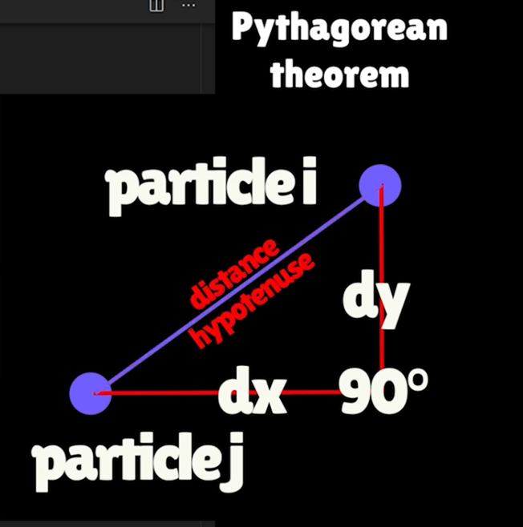
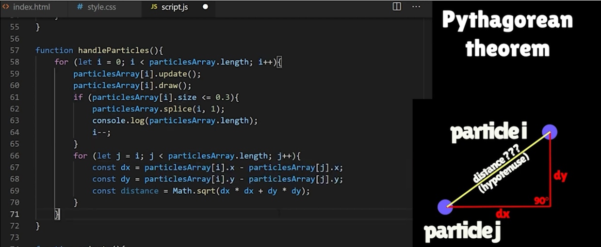

# CONSTELLATION EFFECT - Advanced Use Case

> Constellation Effect is where each particle connects to all particles with in a  certain distance around it with a line. 
>
- Constellation effect is achieved by comparing every particle within particlesArray[] to every other particle in that array.
- We calculate their distance and if they're within certain range from the others, we draw a line from particle A to particle B.
> How do we translate the above into JavaScript

- [x] The `handleParticles()` cycles through `particlesArray`[] for every form of animation.
- [x] Create a nested `for` loop, cycle through each particle comparing their distances.
- [x] Use `Pythagorean theorem` to calculate distance between two points on canvas (two center of our circle particles).
- [x] We imagine a right angle triangle between these two points, `i` and `j` 



- [x] The distance becomes easy to find



- [x] Translate the logic into javascript
  - [x] Find dx 
  - [x] Find dy
  - [x] Calculate the distance on our imaginary right angled triangle.




### 1. No colour on the Constellation lines 
```javascript
const canvas = document.getElementById('canvas1');
const ctx = canvas.getContext('2d');
console.log(canvas);

canvas.width = window.innerWidth;
canvas.height = window.innerHeight;
const particlesArray = [];

//CREATE A GLOBAL VARIABLE hue
let hue = 0;

console.log(ctx);

window.addEventListener('resize', function () {
    canvas.width = window.innerWidth;
    canvas.height = window.innerHeight;

});


/**
 * INTERACTIVE CANVAS
 * - Draw a circle everytime the mouse is clicked on the canvas
 * - Mouse move event to track mouse position: code gets triggered each time a moves over the canvas 
 * - Make an animation
 * - Draw randomized circles on the canvas that interact with mouse in different ways
 * 
 * - Random sized circles move around the canvas till there's no circle
 * - Circles reduce
 */
const mouse = {
    // x and y coordinates of the mouse so that they're global all over the program
    x: undefined,
    y: undefined,
}

canvas.addEventListener('click', function (event) {
    // Everytime the mouse is clicked, the x and y coordinates of the mouse are updated
    mouse.x = event.x;
    console.log(event);
    console.log(mouse.x);
    mouse.y = event.y;

    /**
     * CREATE A PARTICLE FIREWORKS
     * - Create more than one circle on click 
     */
    for (let i = 0; i < 10; i++) {
        particlesArray.push(new Particle());
    }

});

//create a simple paint brush in canvas
canvas.addEventListener('mousemove', function (event) {
    //update the mouse coordinates on mouse move
    mouse.x = event.x;
    mouse.y = event.y;
    console.log(mouse.x, mouse.y);

    /**
     * CREATE PARTICLE TRAILS ON MOUSE OVER
     */
    for (let i = 0; i < 10; i++) {
        particlesArray.push(new Particle());
    }

});


/** * RANDOMIZED CIRCLES
*/

//Each particle will be one circle
// Each time we call the class, it will create one new object
class Particle {
    constructor() {

        this.x = mouse.x;
        this.y = mouse.y;

        /*
        // x and y postitons to be random on the canvas respectively
        this.x = Math.random() * canvas.width;
        this.y = Math.random() * canvas.height;
        */

        //particles to be different sizes
        this.size = Math.random() * 15 + 1; //random size between 1 and 16
        this.speedX = Math.random() * 3 - 1.5; //random speed between -1.5 and 1.5
        this.speedY = Math.random() * 3 - 1.5; //random speed between -1.5 and 1.5

        //create the color property and assign it the dynamic hue
        this.color = 'hsl(' + hue + ', 100%, 50%)';
    }

    //Behaviour: method to draw the particle

    //HOW TO CREATE a simple 2D ANIMATION ON CANVAS
    update() {
        this.x += this.speedX; // positive move to the right, negative move to the left along x-axis
        this.y += this.speedY; // positive move down, negative move up along y-axis

        // * - Make particles shrink as they move around
        if (this.size > 0.2) {
            this.size -= 0.1;
        }
    }

    draw() {
        //ctx.fillStyle = 'white';

        ctx.fillStyle = this.color;
        ctx.beginPath();
        ctx.arc(this.x, this.y, this.size, 0, Math.PI * 2);
        ctx.fill();
    }

}

/*
//function that will call draw() run many times - LOOP
function init() {
    //100 randomised particles with random sizes and speed
    for (let i = 0; i < 100; i++) {
        particlesArray.push(new Particle()); //create one new object
    }
}

init();
console.log(particlesArray);
*/


// * - cycle through the array and trigger the update() & draw() for each indvidual particle making them move around and draw them
function handleParticles() {
    for (let i = 0; i < particlesArray.length; i++) {
        //cycle through the methods
        particlesArray[i].update();
        particlesArray[i].draw();

        //nested for loop for the constellation logic
        for (let j = i; j < particlesArray.length; j++) {
            const dx = particlesArray[i].x - particlesArray[j].x;
            const dy = particlesArray[i].y - particlesArray[j].y;
            const distance = Math.sqrt(dx * dx + dy * dy);

            if (distance < 100) {
                //draw a line from particle i position to particle j position connecting them together
                ctx.beginPath(); //to draw a line, start with beginPath()
                //starting point: moveTo() expect x and y cordinates
                ctx.moveTo(particlesArray[i].x, particlesArray[i].y);
                //end point: lineTo() expect x and y cordinates
                ctx.lineTo(particlesArray[j].x, particlesArray[j].y);
                // to show the line drawn
                ctx.stroke();
            }
        }

        //As i Shrink partcles: remove particles of radius 0.3 is less or equal to negatives
        if (particlesArray[i].size <= 0.3) {
            //remove those particle : use splice() built-in 
            particlesArray.splice(i, 1); //pass the arguments to remove

            //see how particles are removed one by one to 0
            console.log(particlesArray.length);

            i--; //
        }
    }

}


// interactive animation
function animate() {
    //clear old paint from the canvas
    ctx.clearRect(0, 0, canvas.width, canvas.height);

    /**
     * **CREATE A COLOURFUL INTERESTING TRAIL OF PARTICLES WHENEVER MOUSE MOVES OVER CANVAS**
     * To make  a big trail of particles, remove the `ctx.clearRect(0, 0, canvas.width, canvas.height);` from the `animate()`.
     * Make the `clearRect()` fade away slowly by:-
     * Adding a semi-transparent rectangle on top of canvas as follows.
     */
    //ctx.fillStyle = 'rgba(0,0,0, .05)';
    //ctx.fillStyle = 'black';
    //ctx.fillRect(0, 0, canvas.width, canvas.height);

    //call function
    handleParticles(); //random circles are formed all over the canvas

    /**
     * Speed at which colours change
     * create an incremented dynamic colour
     */
    //hue++;
    hue += 5;

    //drawCircle();

    requestAnimationFrame(animate);
}
//call function to start t he animation
animate();
```


### 2. Dynamic Colour on the Constellation lines and dynamic size
```javascript
const canvas = document.getElementById('canvas1');
const ctx = canvas.getContext('2d');
console.log(canvas);

canvas.width = window.innerWidth;
canvas.height = window.innerHeight;
const particlesArray = [];

//CREATE A GLOBAL VARIABLE hue
let hue = 0;

console.log(ctx);

window.addEventListener('resize', function () {
    canvas.width = window.innerWidth;
    canvas.height = window.innerHeight;

});


/**
 * INTERACTIVE CANVAS
 * - Draw a circle everytime the mouse is clicked on the canvas
 * - Mouse move event to track mouse position: code gets triggered each time a moves over the canvas 
 * - Make an animation
 * - Draw randomized circles on the canvas that interact with mouse in different ways
 * 
 * - Random sized circles move around the canvas till there's no circle
 * - Circles reduce
 */
const mouse = {
    // x and y coordinates of the mouse so that they're global all over the program
    x: undefined,
    y: undefined,
}

canvas.addEventListener('click', function (event) {
    // Everytime the mouse is clicked, the x and y coordinates of the mouse are updated
    mouse.x = event.x;
    console.log(event);
    console.log(mouse.x);
    mouse.y = event.y;

    /**
     * CREATE A PARTICLE FIREWORKS
     * - Create more than one circle on click 
     */
    for (let i = 0; i < 10; i++) {
        particlesArray.push(new Particle());
    }

});

//create a simple paint brush in canvas
canvas.addEventListener('mousemove', function (event) {
    //update the mouse coordinates on mouse move
    mouse.x = event.x;
    mouse.y = event.y;
    console.log(mouse.x, mouse.y);

    /**
     * CREATE PARTICLE TRAILS ON MOUSE OVER
     */
    for (let i = 0; i < 10; i++) {
        particlesArray.push(new Particle());
    }

});


/** * RANDOMIZED CIRCLES
*/

//Each particle will be one circle
// Each time we call the class, it will create one new object
class Particle {
    constructor() {

        this.x = mouse.x;
        this.y = mouse.y;

        //particles to be different sizes
        this.size = Math.random() * 15 + 1; //random size between 1 and 16
        this.speedX = Math.random() * 3 - 1.5; //random speed between -1.5 and 1.5
        this.speedY = Math.random() * 3 - 1.5; //random speed between -1.5 and 1.5

        //create the color property and assign it the dynamic hue
        this.color = 'hsl(' + hue + ', 100%, 50%)';
    }

    //Behaviour: method to draw the particle

    //HOW TO CREATE a simple 2D ANIMATION ON CANVAS
    update() {
        this.x += this.speedX; // positive move to the right, negative move to the left along x-axis
        this.y += this.speedY; // positive move down, negative move up along y-axis

        // * - Make particles shrink as they move around
        if (this.size > 0.2) {
            this.size -= 0.1;
        }
    }

    draw() {
        //ctx.fillStyle = 'white';

        ctx.fillStyle = this.color;
        ctx.beginPath();
        ctx.arc(this.x, this.y, this.size, 0, Math.PI * 2);
        ctx.fill();
    }

}

/*
//function that will call draw() run many times - LOOP
function init() {
    //100 randomised particles with random sizes and speed
    for (let i = 0; i < 100; i++) {
        particlesArray.push(new Particle()); //create one new object
    }
}

init();
console.log(particlesArray);
*/


// * - cycle through the array and trigger the update() & draw() for each indvidual particle making them move around and draw them
function handleParticles() {
    for (let i = 0; i < particlesArray.length; i++) {
        //cycle through the methods
        particlesArray[i].update();
        particlesArray[i].draw();

        //nested for loop for the constellation logic
        for (let j = i; j < particlesArray.length; j++) {
            const dx = particlesArray[i].x - particlesArray[j].x;
            const dy = particlesArray[i].y - particlesArray[j].y;
            const distance = Math.sqrt(dx * dx + dy * dy);

            if (distance < 100) {
                //draw a line from particle i position to particle j position connecting them together
                ctx.beginPath(); //to draw a line, start with beginPath()

                //add dynamic colour to the lines
                ctx.strokeStyle = particlesArray[i].color;

                //dynamic size of line: lines are the same size as the raduis of the circles
                //ctx.lineWidth = particlesArray[i].size;
                ctx.lineWidth = particlesArray[i].size / 10;

                //starting point: moveTo() expect x and y cordinates
                ctx.moveTo(particlesArray[i].x, particlesArray[i].y);
                //end point: lineTo() expect x and y cordinates
                ctx.lineTo(particlesArray[j].x, particlesArray[j].y);
                // to show the line drawn
                ctx.stroke();
            }
        }

        //As i Shrink partcles: remove particles of radius 0.3 is less or equal to negatives
        if (particlesArray[i].size <= 0.3) {
            //remove those particle : use splice() built-in 
            particlesArray.splice(i, 1); //pass the arguments to remove

            //see how particles are removed one by one to 0
            console.log(particlesArray.length);

            i--; //
        }
    }

}


// interactive animation
function animate() {
    //clear old paint from the canvas
    ctx.clearRect(0, 0, canvas.width, canvas.height);

    /**
     * **CREATE A COLOURFUL INTERESTING TRAIL OF PARTICLES WHENEVER MOUSE MOVES OVER CANVAS**
     * To make  a big trail of particles, remove the `ctx.clearRect(0, 0, canvas.width, canvas.height);` from the `animate()`.
     * Make the `clearRect()` fade away slowly by:-
     * Adding a semi-transparent rectangle on top of canvas as follows.
     */
    //ctx.fillStyle = 'rgba(0,0,0, .05)';
    //ctx.fillStyle = 'black';
    //ctx.fillRect(0, 0, canvas.width, canvas.height);

    //call function
    handleParticles(); //random circles are formed all over the canvas

    /**
     * Speed at which colours change
     * create an incremented dynamic colour
     */
    //hue++;
    hue += 5;

    //drawCircle();

    requestAnimationFrame(animate);
}
//call function to start t he animation
animate();
```


